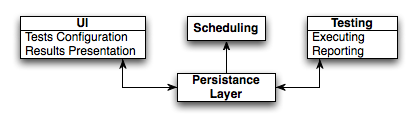
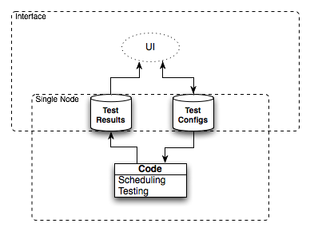
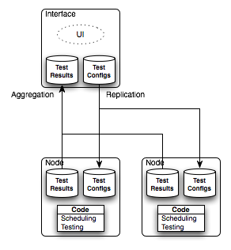

========================
Architecture Description
========================  

.. _arch_components:

Design decisions and considerations
===================================

**Notice:** the problem did not require 99999 availability but I took on purpose (for fun and educational purposes) it a little bit in that direction. I called the project *jiggety*  after `Jiggety Jig <http://muppet.wikia.com/wiki/Jiggety_Jig>`_ to emphasis it not too serious project :)

In next few points describe things I considered important and took into account: 

- **fault-tolerance** regarding both machines and network corruption
- **self-manageability** by minimizing the administration effort (especially useful in multi-node configuration)
- **clarity and quality** of results be accurate and avoid making false alerts (especially HTTP response time)
- important note **HTTP response time != page load time** 
    - to test that the test should run in real browser environment that has Javascript support ie. *Selenium* 
    - **loosely coupled** test execution environment making replacing/extending easy 
    - more then one execution, collecting results and **summarizing should be taken into design** (similarity to the distributed testing case)
- **scheduling** could be a global option but I decided to give more freedom and make per test setting
    - using cron for scheduling **flexibility and separation** (each test as a separate process) 
    - self_refreshig of *what test* and *when*  should run

I took *syslog* functionality (when all test runners report to one machine) for data exchange . Some advantages of using CouchDB over *syslog* in that case:                                   

- when the global syslog machine goes down (due machine or network fail) there is a chance that messages will get lost 
- after it recovers some extra synchronization will be required what is not the case of CouchDB replication
- map/reduce tasks seem as a good match for log analysis 

There are some similar issues when it comes the classic RDBMS and CouchDB for choosing a solution for test configuration. I share the filling that none of above given reasons makes in given case a huge difference and the main motivation was to make an experiment with CouchDB.

Overview
========

I decomposed the architecture into four functional elements presented in the figure below: 

- **Persistence Layer** - Holding the test configuration and test results. I decided myself for **CouchDB** in this case.
- **UI** - Letting user to manipulate the test configuration and browse test results. I chose **Django** web framework for building that part.
- **Scheduling** - Running periodically tests accordingly to user settings. **Cron** id a solution joining simplicity with flexibility.
- **Testing** - Executing the user defined tests and reporting results to *Persistence Layer*. Keeping in mind that the test object is HTTP server response times and content **Twill** looks as a best candidate for that job. 

     
    Functional components of the system

In the figures bellow I illustrate how the architecture would change if the system would run in multi-node configuration. I Decided to make use of CouchDB replication to keep the *testing nodes* in sync with the user defined test configuration. Would would require code changes would be:

- an extra aggregation step in CouchDB 
- automate procedure for adding new *testing nodes*
- some minor modifications in the UI to expose the multi-node feature to the user
   

   

    