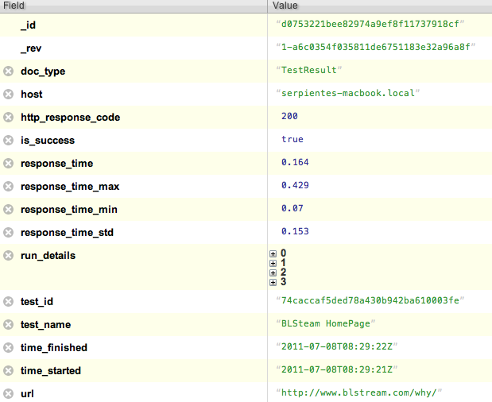
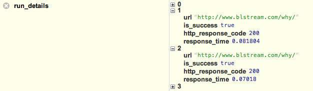

========================
How does it looks like ?
========================

Test Configuration
==================

.. figure:: _static/TestConfig.png
    :alt: Sipmle page-test confguration
    
    Sipmle page-test confguration   

.. figure:: _static/TestConfig404.png
    :alt: Configuration for HTTP 404 Not Found   

    Configuration for HTTP 404 Not Found
                
Test Results
============

    
    The test result report 

    
    The run details 

.. figure:: _static/LogFile.png
    :align: center
    :alt: The test result report
    
    The test result report 

